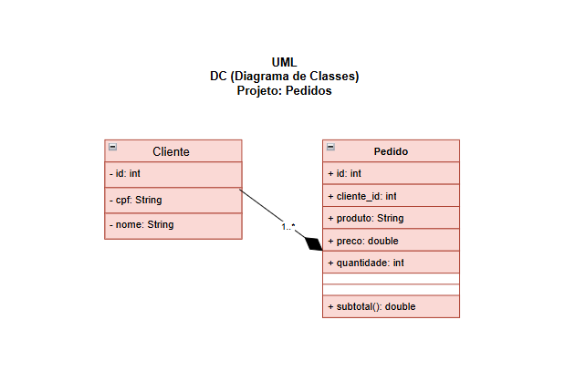
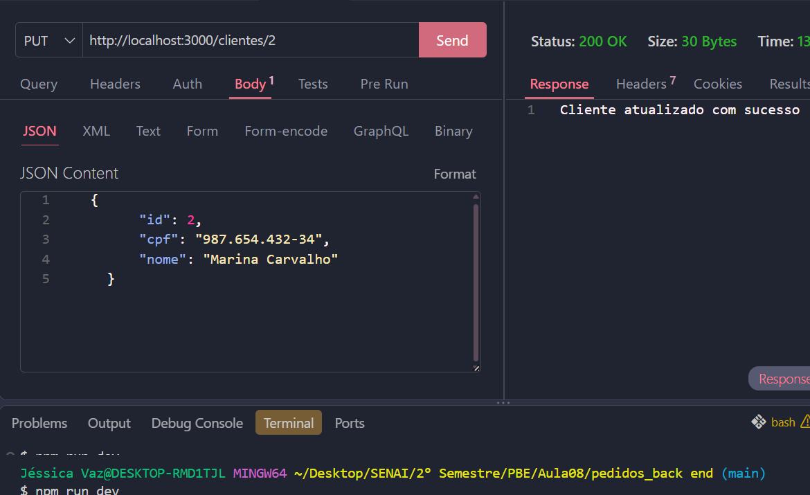
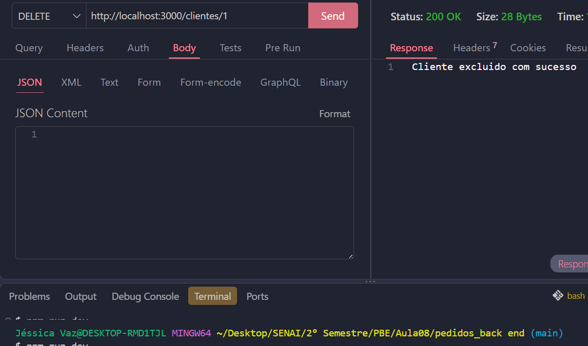
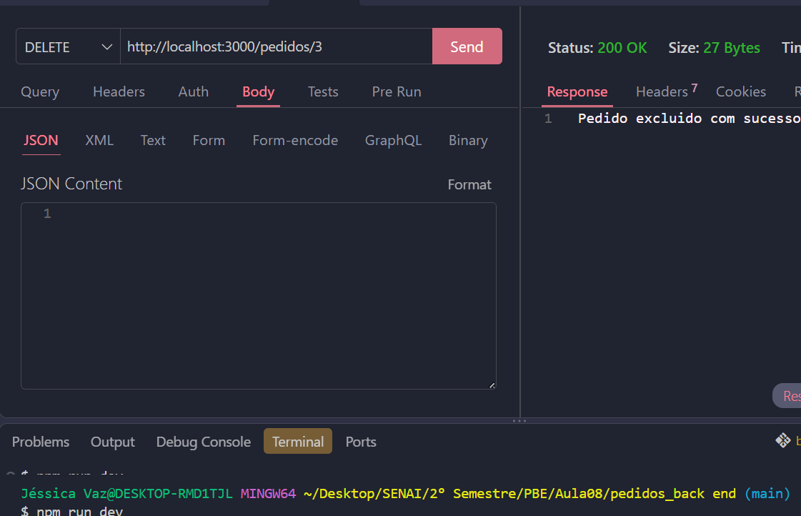

# Pedidos Backend MVC DC

Back-end com duas coleções mockup JSON clientes e pedidos, CRUD, para aprender, MVC e UML diagrama de classes.

## Diagrama:



## Tecnologias:

 - Node.js
 - VsCode (Thunder Client)
 - JavaScript
 - MVC

 ## Passos para testar: 

 - Clone esta repositório e abra com VsCode
 - Instale as depenências e execute com os seguintes comandos no terminal:

```
 npm install
 npm run dev
```

## Testes: 

 - POST: 

Clientes(Alterar)

Pedidos(Alterar)


- DELETE:

Clientes(Excluir)

Pedidos(Excluir)



